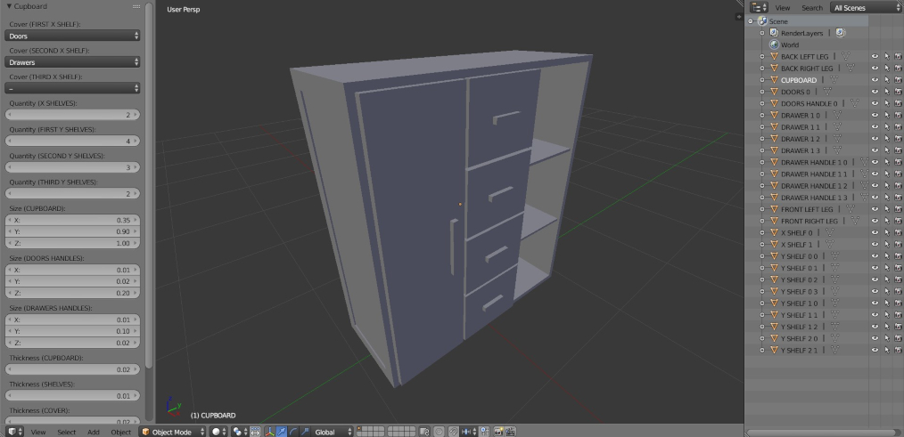
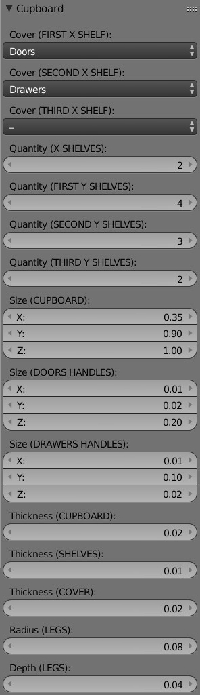
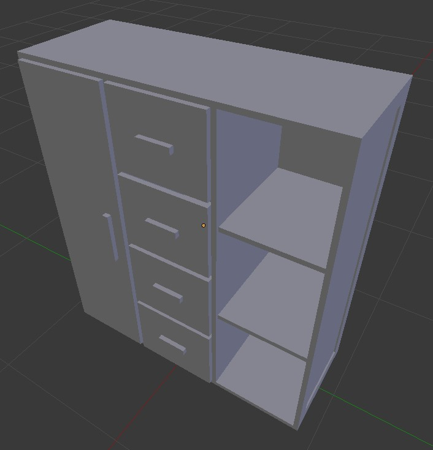
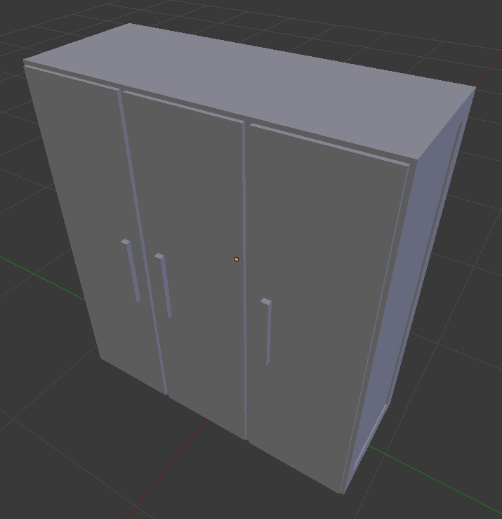
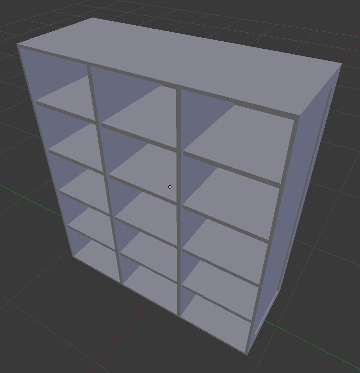
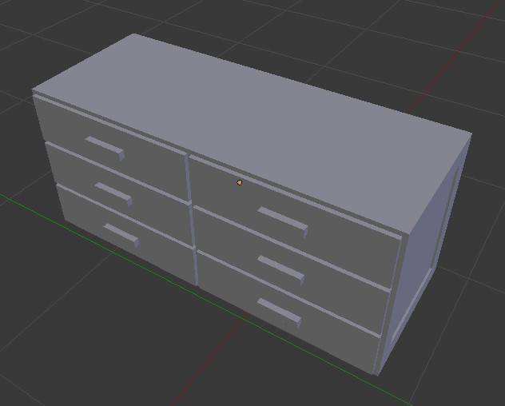
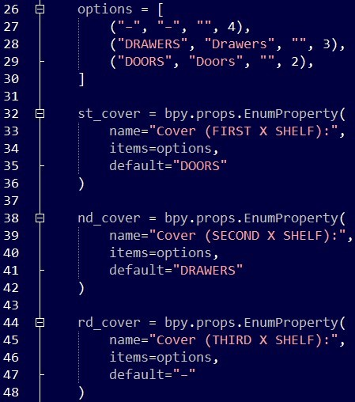
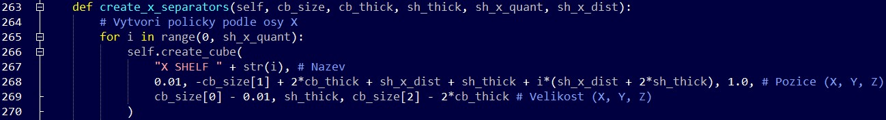

== **Základní informace**

**Název:** Generátor skříní

**Obrázek:**
 

 
**Datum vydání:** 30. 1. 20

**Doba vývoje:** 5 dní

**Programovací jazyk:** Python

**Program:** Blender 2.79b

**Instalace**: 

*** Výběr ZIP archivu __cupboard.zip__ přes __File / User Preferences... / Install Add-on from File...__ a jeho aktivace (resp. zafajfkování)
*** Otevření souboru __cupboard.py__ v textovém editoru Blenderu a kliknutí na **Run Script**

**Spuštění**: Kliknutí na položku __Add > Mesh > Cupboard__

== **Popis**

**Generátor objektů** je plug-in, který umožňuje generovat a upravovat skříně. K dispozici je celkem **15 parametrů**, díky kterým si uživatel může skříň nejen přizpůsobit k obrazu svému, ale vytvářet i další podobné kusy nábytku, jako např. komody. Cílem této tvorby bylo vytvořit praktický doplněk, který by v dalších verzích mohl najít reálné využití. Výsledek může posloužit jako podklad k vytvoření mnohem univerzálnějšího nástroje pro generování domácího nábytku.

== **Parametry**

** **Cover (FIRST X SHELF)**
*** Pokrytí místa nalevo od první vertikální poličky (možnosti: dvířka, šuplíky, bez pokrytí)

** **Cover (SECOND X SHELF)**
*** Pokrytí místa napravo od první vertikální poličky (možnosti: dvířka, šuplíky, bez pokrytí)

** **Cover (THIRD X SHELF)**
*** Pokrytí místa napravo od druhé vertikální poličky (možnosti: dvířka, šuplíky, bez pokrytí)

** **Quantity (X SHELVES)**
*** Počet vertikálních poliček

** **Quantity (FIRST Y SHELVES)**
*** Počet prvních horizontálních poliček

** **Quantity (SECOND Y SHELVES)**
*** Počet druhých horizontálních poliček

** **Quantity (THIRD Y SHELVES)**
*** Počet třetích horizontálních poliček

** **Size (CUPBOARD)**
*** Velikost skříně

** **Size (DOORS HANDLES)**
*** Velikost rukojetí u dvířek

** **Size (DRAWERS HANDLES)**
*** Velikost rukojetí u šuplíků

** **Thickness (CUPBOARD)**
*** Tloušťka skříně

** **Thickness (SHELVES)**
*** Tloušťka poliček

** **Thickness (COVER)**
*** Tloušťka pokrytí (dvířek, šuplíků)

** **Radius (LEGS)**
*** Poloměr noh

** **Depth (LEGS)**
*** Výška noh

== **Ukázky**

Kombinací jednotlivých parametrů lze dosáhnout mnoha různých výsledků.

=== Kombinovaná skříň

=== Šatní skříň

=== Otevřená zásuvková skříň

=== Komoda

== **Program**

Kód doplňku se skládá z následujících částí, proměnných a funkcí:

* __bl_info__ – základní konfigurace doplňku
* třída __Cupboard__
** __bl_idname__, __bl_label__, __bl_options__ – základní proměnné popisující doplněk
** **GUI** – veškeré ovládání/parametry pro úpravu skříně
** **Základní metody**
*** __execute()__ – vytvoří všechny části skříně
*** __create_cube()__ – vytvoří jednoduchou krychli/kvádr (v závislosti na předaných parametrech)
*** __create_cylinder()__ – vytvoří jednoduchý válec (v závislosti na předaných parametrech)
*** __make_difference()__ – provede rozdíl dvou objektů
*** __create_cupboard()__ – vytvoří samotnou skříň
*** __create_legs()__ – vytvoří nohy skříně
*** __create_x_separators()__ – vytvoří vertikální poličky seřazené podle osy X
*** __create_y_separators()__ – vytvoří horizontální poličky seřazené podle osy Y
*** __create_doors()__ – vytvoří dvířka (pokud jsou požadována)
*** __create_drawers()__ – vytvoří šuplíky (pokud jsou požadovány)
* __cb_item()__, __register()__, __unregister()__ – základní funkce provádějící registraci doplňku

== **Ukázka z části „GUI“**

Jako ukázku z GUI jsem si vybral úryvek kódu, který uživateli umožní nastavit, zdali mají jednotlivé části skříně (oddělené vertikálními poličkami) pokrývat dvířka, šuplíky, nebo zda mají zůstat prázdné.

== **Ukázka z části „Základní metody“**

Pro tuto část poslouží metoda __create_x_separators()__, která vygeneruje daný počet vertikálních poliček seřazených podle osy X. Vlastní generování zařídí metoda __create_cube()__, které se pouze předají parametry pro název, pozici (X, Y, Z) a velikost (X, Y, Z) objektu. Např. pro výpočet Y-ové složky pozice se v rámci skříně postupuje zleva doprava a jsou v něm uvažovány i ostatní parametry (např. tloušťka skříně) tak, aby byl výsledek opravdu přesný. Pro výpočet X-ové složky pozice a velikosti se zase musí počítat se zadní stěnou, která má konstantní tloušťku 0.02. Důležité je zmínit, že ohledně velikosti dodáváme hodnoty, které znamenají pouze **poloměr** vytvořené krychle, zatímco ohledně pozice musíme tyto hodnoty zdvojnásobit.

== **Reference**

https://docs.blender.org/api/2.79/

https://docs.blender.org/manual/en/latest/

https://blender.stackexchange.com/
